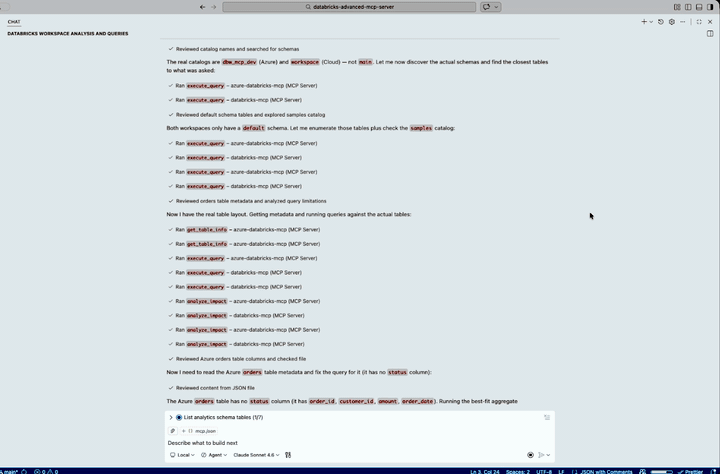

# Databricks Advanced MCP Server

[](https://www.python.org/downloads/)
[](LICENSE)
[](https://modelcontextprotocol.io)

An advanced [Model Context Protocol (MCP)](https://modelcontextprotocol.io) server that gives AI assistants deep visibility into your Databricks workspace - dependency scanning, impact analysis, notebook review, job/pipeline operations, SQL execution, and table metadata inspection.

## Features

| Domain | What it does |
|---|---|
| **SQL Execution** | Run SQL queries against Databricks SQL warehouses with configurable result limits |
| **Table Information** | Inspect table metadata, schemas, column details, row counts, and storage info |
| **Dependency Scanning** | Scan notebooks, jobs, and DLT pipelines to build a workspace dependency graph (DAG) |
| **Impact Analysis** | Predict downstream breakage from column drops, schema changes, or pipeline failures |
| **Notebook Review** | Detect performance anti-patterns, coding standard violations, and suggest optimizations |
| **Job & Pipeline Ops** | List jobs/pipelines, get run status with error diagnostics, trigger reruns |

## Demo

[](https://github.com/user-attachments/assets/579282ca-bb26-4244-b0c6-3ad26050aca3)

<details>

<summary>Click to play full video</summary>

https://github.com/user-attachments/assets/579282ca-bb26-4244-b0c6-3ad26050aca3

</details>

> Covers SQL execution, dependency scanning, impact analysis, notebook review, and job/pipeline operations.

## Quick Start

### Prerequisites

- **Python 3.11+**
- **[uv](https://docs.astral.sh/uv/)** — fast Python package manager
- A **Databricks workspace** with a SQL warehouse
- A Databricks **personal access token**

> **Other auth methods:** The Databricks SDK supports [unified authentication](https://docs.databricks.com/en/dev-tools/auth/unified-auth.html) — if you don't set `DATABRICKS_TOKEN`, it will fall back to Azure CLI, managed identity, or `.databrickscfg`. The `.env` setup below uses a PAT for simplicity.
>
> **Don't have a Databricks workspace yet?** See [`infra/INSTALL.md`](infra/INSTALL.md) for a one-command Azure deployment using Bicep.

### 1. Install

#### Option A: Install from PyPI (recommended)

```bash
uv pip install databricks-advanced-mcp
```

Or with pip:

```bash
pip install databricks-advanced-mcp
```

#### Option B: Install from source

```bash
git clone https://github.com/henrybravo/databricks-advanced-mcp-server.git
cd databricks-advanced-mcp-server
```

Create and activate a virtual environment:

**Windows (PowerShell)**
```powershell
uv venv .venv
.\.venv\Scripts\Activate.ps1
uv pip install -e .
```

**macOS / Linux**
```bash
uv venv .venv
source .venv/bin/activate
uv pip install -e .
```

### 2. Configure

```bash
cp .env.example .env
```

Edit `.env` with your Databricks credentials:

```dotenv
# Azure Databricks:
DATABRICKS_HOST=https://adb-xxxx.azuredatabricks.net
# Databricks on AWS / GCP:
# DATABRICKS_HOST=https://dbc-xxxx.cloud.databricks.com

DATABRICKS_TOKEN=dapi_your_token
DATABRICKS_WAREHOUSE_ID=your_warehouse_id

# Optional (defaults shown)
# Azure workspaces typically use "main"; AWS/GCP workspaces use "workspace"
DATABRICKS_CATALOG=main
DATABRICKS_SCHEMA=default
```

### 3. Add to your IDE

Create `.vscode/mcp.json` in your project to register the MCP server with VS Code / GitHub Copilot.

#### Option A: PyPI install (recommended)

If you installed from PyPI (`pip install databricks-advanced-mcp`), the `databricks-mcp` CLI is available on your PATH:

```jsonc
{
  "servers": {
    "databricks-mcp": {
      "type": "stdio",
      "command": "databricks-mcp",
      "env": {
        "DATABRICKS_HOST": "https://adb-xxxx.azuredatabricks.net",
        "DATABRICKS_TOKEN": "dapi_your_token",
        "DATABRICKS_WAREHOUSE_ID": "your_warehouse_id"
      }
    }
  }
}
```

#### Option B: Virtual environment (source install)

If you cloned the repo and installed into a local `.venv`, point directly to the Python interpreter:

**Windows**
```jsonc
{
  "servers": {
    "databricks-mcp": {
      "type": "stdio",
      "command": "${workspaceFolder}/.venv/Scripts/python.exe",
      "args": ["-m", "databricks_advanced_mcp.server"],
      "envFile": "${workspaceFolder}/.env"
    }
  }
}
```

**macOS / Linux**
```jsonc
{
  "servers": {
    "databricks-mcp": {
      "type": "stdio",
      "command": "${workspaceFolder}/.venv/bin/python",
      "args": ["-m", "databricks_advanced_mcp.server"],
      "envFile": "${workspaceFolder}/.env"
    }
  }
}
```

#### Multiple Workspaces

Each MCP server instance connects to exactly one Databricks workspace. To work with multiple workspaces simultaneously, register a separate server entry per workspace — each with its own credentials:

```jsonc
{
  "servers": {
    // AWS / GCP workspace
    "databricks-cloud": {
      "type": "stdio",
      "command": "databricks-mcp",
      "env": {
        "DATABRICKS_HOST": "https://dbc-xxxx.cloud.databricks.com",
        "DATABRICKS_TOKEN": "dapi_cloud_token",
        "DATABRICKS_WAREHOUSE_ID": "cloud_warehouse_id",
        "DATABRICKS_CATALOG": "workspace"
      }
    },
    // Azure workspace
    "databricks-azure": {
      "type": "stdio",
      "command": "databricks-mcp",
      "env": {
        "DATABRICKS_HOST": "https://adb-xxxx.azuredatabricks.net",
        "DATABRICKS_TOKEN": "dapi_azure_token",
        "DATABRICKS_WAREHOUSE_ID": "azure_warehouse_id",
        "DATABRICKS_CATALOG": "main"
      }
    }
  }
}
```

Alternatively, with a source install you can use separate `.env` files per workspace:

```jsonc
{
  "servers": {
    "databricks-cloud": {
      "type": "stdio",
      "command": "${workspaceFolder}/.venv/bin/python",
      "args": ["-m", "databricks_advanced_mcp.server"],
      "envFile": "${workspaceFolder}/.env"
    },
    "databricks-azure": {
      "type": "stdio",
      "command": "${workspaceFolder}/.venv/bin/python",
      "args": ["-m", "databricks_advanced_mcp.server"],
      "envFile": "${workspaceFolder}/.env_azure"
    }
  }
}
```

### 4. Start using

Once configured, your AI assistant can call any of the 18 tools below. Here are example prompts organized by domain:

**Explore your data**
- *"What tables exist in the `analytics` schema?"*
- *"Show me the schema and metadata for `main.sales.orders`"*
- *"Run a query that counts and sums orders by status from `main.sales.orders`"*

**Understand dependencies**
- *"Build the full workspace dependency graph"*
- *"What are the upstream and downstream dependencies of `main.default.customers`?"*
- *"Scan the `/Shared/mandated_broker_v2_etl_pipeline` notebook for table references"*
- *"Scan all jobs and show their table dependencies"*

**Assess impact before making changes**
- *"What would break if I drop the `customer_id` column from `main.default.customers`?"*
- *"What's the impact of removing the `amount` column and renaming `status` to `order_status` in `main.sales.orders`?"*

**Review notebook quality**
- *"Review `/Shared/mandated_broker_v2_etl_pipeline` for performance issues"*
- *"Review `/Shared/analysis` for all issues — performance, coding standards, and optimizations"*

**Monitor jobs and pipelines**
- *"List all jobs in the workspace"*
- *"What's the current status of job 12345?"*
- *"Show me the pipeline status for my DLT pipeline"*

## MCP Tools

| Tool | Description |
|---|---|
| `execute_query` | Execute SQL against a Databricks SQL warehouse |
| `get_table_info` | Get table metadata — columns, row count, properties, storage |
| `list_tables` | List tables in a catalog.schema |
| `scan_notebook` | Scan a notebook for table/column references |
| `scan_jobs` | Scan all jobs for table dependencies |
| `scan_dlt_pipelines` | Scan all DLT pipelines for source/target tables |
| `scan_dlt_pipeline` | Scan a single DLT pipeline by ID for source/target tables |
| `build_dependency_graph` | Build the full workspace dependency graph |
| `get_table_dependencies` | Get upstream/downstream dependencies for a table |
| `refresh_graph` | Invalidate and rebuild the dependency graph cache |
| `analyze_impact` | Analyze impact of column drop / schema change / pipeline failure |
| `review_notebook` | Review a notebook for issues, anti-patterns, and optimizations |
| `list_jobs` | List jobs with status and schedule info |
| `get_job_status` | Get detailed job run status with error diagnostics |
| `list_pipelines` | List DLT pipelines with state and update status |
| `get_pipeline_status` | Get pipeline update details with event log |
| `trigger_rerun` | Trigger a job rerun (requires confirmation) |
| `list_workspace_notebooks` | List all notebooks in a workspace path |

## Configuration Reference

| Variable | Required | Default | Description |
|---|---|---|---|
| `DATABRICKS_HOST` | Yes | — | Workspace URL (`https://adb-xxx.azuredatabricks.net` for Azure, `https://dbc-xxx.cloud.databricks.com` for AWS/GCP) |
| `DATABRICKS_TOKEN` | Yes | — | Personal access token or service principal token |
| `DATABRICKS_WAREHOUSE_ID` | Yes | — | SQL warehouse ID for query execution |
| `DATABRICKS_CATALOG` | No | `main` | Default catalog for unqualified table names — use `workspace` for AWS/GCP |
| `DATABRICKS_SCHEMA` | No | `default` | Default schema for unqualified table names |

### Cloud Provider Notes

This server is tested against **Azure Databricks** and **Databricks on AWS** (`.cloud.databricks.com`). Key differences:

| Aspect | Azure | AWS / GCP |
|---|---|---|
| Host format | `https://adb-xxx.azuredatabricks.net` | `https://dbc-xxx.cloud.databricks.com` |
| Default catalog | `main` | `workspace` |
| Workspace root objects | `DIRECTORY` | `DIRECTORY` and `REPO` |

All tools work on both platforms. Set `DATABRICKS_CATALOG` to match your workspace's default catalog.

## Infrastructure (Optional)

If you need to provision a new Azure Databricks workspace, the `infra/` directory contains:

- **`main.bicep`** — Azure Bicep template (Premium SKU, Unity Catalog enabled)
- **`deploy.ps1`** — One-command PowerShell deployment script
- **`INSTALL.md`** — Detailed step-by-step deployment guide

```bash
cd infra
./deploy.ps1 -ResourceGroupName rg-databricks-mcp -Location eastus2
```

## Development

```bash
# Install with dev dependencies
uv pip install -e ".[dev]"

# Run tests
uv run pytest

# Lint
uv run ruff check src/ tests/

# Type check
uv run mypy src/
```

## Architecture

```
src/databricks_advanced_mcp/
├── server.py          # FastMCP server + CLI entry point
├── config.py          # Pydantic settings from env vars
├── client.py          # Databricks SDK client factory
├── tools/             # MCP tool implementations
│   ├── sql_executor.py
│   ├── dependency_scanner.py
│   ├── impact_analysis.py
│   ├── notebook_reviewer.py
│   ├── job_pipeline_ops.py
|   ├── table_info.py
|   └── workspace_listing.py
├── parsers/           # Code parsing engines
│   ├── sql_parser.py       # sqlglot-based SQL extraction
│   ├── notebook_parser.py  # Databricks notebook cell parsing
│   └── dlt_parser.py       # DLT pipeline definition parsing
├── graph/             # Dependency graph
│   ├── models.py      # Node, Edge, DependencyGraph data models
│   ├── builder.py     # Graph builder (orchestrates scans)
│   └── cache.py       # In-memory graph cache with TTL
└── reviewers/         # Notebook review rule engines
    ├── performance.py # Performance anti-patterns
    ├── standards.py   # Coding standards checks
    └── suggestions.py # Optimization suggestions
```

## License

[MIT](LICENSE)
